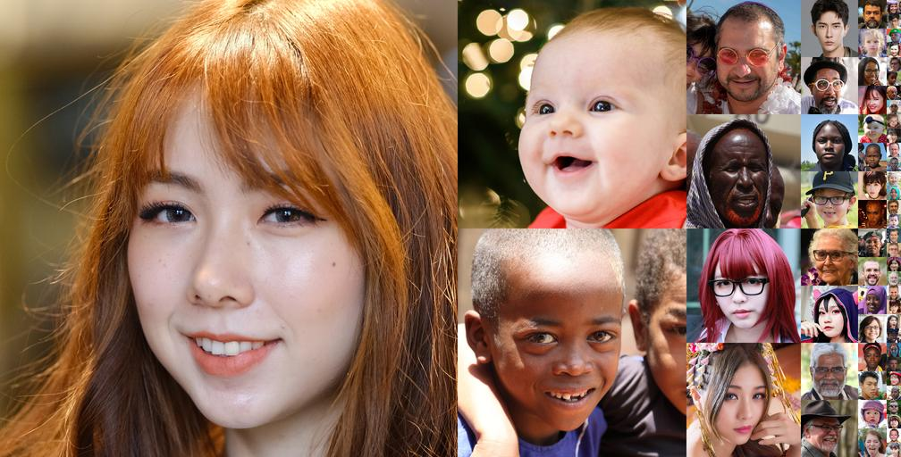
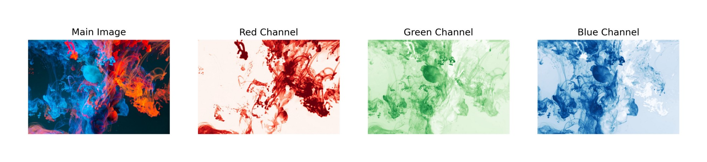
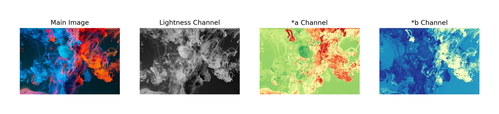
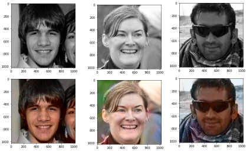

# Image Colorization

The goal of this project is to investigate and build a deep learning architecture based on the use of a neural network to colorize black and white photos of faces. Several years ago, this task required a lot of human input and hardcoding, but now, thanks to AI and deep learning, the entire process can be completed end-to-end.

## Project Description

We use a dataset of colored photos for this project. This will serve as our baseline for determining the outcomes we want our model to provide. These colourful photos are then converted to grayscale. A training set and a test set of grayscale images were created. The training set photos, together with their matching color images, are then sent to our model (a hybrid of VGG-16 and CNN), which &quot;learns&quot; how to color an image. The model is then put to the test by feeding it a grayscale image as input. On its alone, it lends color to these photographs. The goal is to have the model apply colors in such a way that they look natural and as near to the source image as feasible.

## About the Dataset

Name: Flickr-Faces-HQ (FFHQ)

Source: https://github.com/NVlabs/ffhq-dataset

Flickr-Faces-HQ (FFHQ) is a collection of 70,000 high-quality PNG photos with a resolution of 1024x1024 pixels, with a wide range of age, ethnicity, and image background. It also covers eyeglasses, sunglasses, caps, and other accessories well. The photographs were crawled from Flickr and automatically aligned and cropped using dlib, adopting all of the website&#39;s biases. The set was pruned using several automatic filters, and then Amazon Mechanical Turk was used to eliminate the occasional statues, paintings, or images of photos.

## Color Space

The first thing we must understand is that Lab color space is employed. The explanation for this is simple: we need to learn three separate channels in color spaces like RGB, whereas we only need to learn two in Lab. The brightness channel has values ranging from 0 (dark) to 100 (light) (light). The positions of the red-green and blue-yellow ranges on the axis are represented by channels a and b, respectively.

Grayscale is represented by a single layer in a Lab-encoded image. The three color layers are then compressed into two. This indicates that in our final prediction, we can use the original grayscale image. Then we only have two options for forecasting.

One advantage of using the Lab color space is that it separates the light intensity values. When making predictions, the model can utilize black and white photographs as the L channel, so it won&#39;t have to learn how to keep light intensities consistent (it will have to do that if RGB is used). The model will simply be taught how to color images, allowing it to concentrate on the tasks at hand.

## RGB

## L\*a\*b

## CNN+VGG-16 Architecture

To achieve great accuracy in the feature extraction procedure, we chose VGG-16 for our encoder. VGG-16&#39;s design is such that it receives an input of size 224 X 224 X 3 (thus the pre-processing image resizing) and returns a softmax prediction over a thousand classes.This network features a massive stacking of convolving layers, with the final feature extraction layer producing a 7 X 7X 512 output. As a result, we&#39;ll use these layers to extract features for our own encoder.

The input image only includes one channel, &#39;L&#39; (which is later stacked behind itself to provide the impression of depth 3 in order to meet our encoder model), and the output image only has two sets of predictions, &#39;a&#39; and &#39;b&#39;, which are then combined with the input &#39;L&#39; to form a reconstructed Lab image. After that, the Lab image is transformed to an RGB image.

## The AI (Deep Learning) Process

**Step 1**

Import the Libraries : We begin the project by importing the necessary libraries.

**Step 2**

Convert the Images to Grayscale :We&#39;ll then convert all the images to grayscale, so that we have a set of color images and their corresponding grayscale versions.

**Step 3**

Load the Data : lspace should be loaded as X and abspace should be loaded as Y. The combined value of the a and b channels, which represent the position in the axis between the red-green and blue-yellow ranges, is abspace, which shows the image&#39;s brightness.

**Step 4**

Structure the Model

**Step 5**

Set the Model Parameters :To complete the architecture of the CNN, we set the optimizer and loss function by creating a function

**Step 6**

.Data Preparation : Before feeding the data into the model, we need to reshape it so that the values are fed into the proper channels

**Step 7**

Train the Model

**Step 8**

View the Results

## Conclusion 
Our initial goal for this project was to use machine learning to automatically color a big dataset of black and white photographs, which we feel we accomplished. However, our models performed better than the goal values in certain cases. Our model performed a good job of turning black and white images into more lifelike pictures in terms of light contrast and full colorization.

## References

GitHub. n.d. _GitHub - NVlabs/ffhq-dataset: Flickr-Faces-HQ Dataset (FFHQ)_. [online] Available at: \&lt;https://github.com/NVlabs/ffhq-dataset\&gt; [Accessed 1 December 2021].

Shariatnia, M., 2020. Colorizing black &amp; white images with U-Net and conditional GAN. [online] Available at:\&lt;https://towardsdatascience.com/colorizing-black-white-images-with-u-net-and-conditional-gan-a-tutorial-81b2df111cd8\&gt; [Accessed 26 November 2021].

Hubel, D. and Wiesel, T., 1962. Receptive fields, binocular interaction and functional architecture in the cat&#39;s visual cortex. _The Journal of Physiology_, 160(1), pp.106-154.

Y. LeCun, Y. Bengio, and G. Hinton. Deep learning. Nature, 521(7553):436–444, 2015
